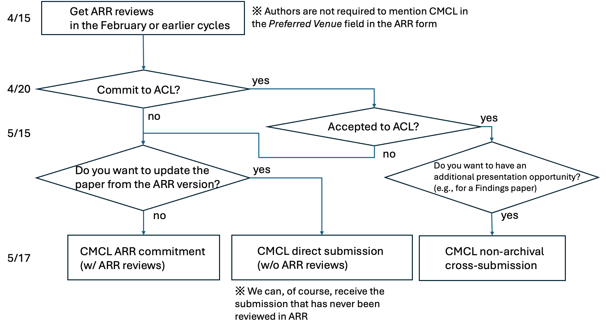

## The 13th edition of the Workshop on Cognitive Modeling and Computational Linguistics (CMCL 2024)

CMCL 2024 will be co-located with the 62nd Annual Meeting of the Association for Computational Linguistics (ACL 2024).

<!--
## Call of Paper

Co-located with ACL 2024 in Bankok, Thailand.

<iframe src="https://www.google.com/maps/embed?pb=!1m18!1m12!1m3!1d992233.6942053817!2d99.97363989628013!3d13.723724826940103!2m3!1f0!2f0!3f0!3m2!1i1024!2i768!4f13.1!3m3!1m2!1s0x311d6032280d61f3%3A0x10100b25de24820!2sBangkok%2C%20Thailandia!5e0!3m2!1sit!2sit!4v1703056488349!5m2!1sit!2sit" width="600" height="450" style="border:0;" allowfullscreen="" loading="lazy" referrerpolicy="no-referrer-when-downgrade"></iframe>

For info:
- [https://cmclorg.github.io](https://cmclorg.github.io)
- [cmclorganizers2024@gmail.com](mailto:cmclorganizers2024@gmail.com)
-->

### Workshop Description
CMCL 2024 is a one-day workshop held in conjunction with ACL 2024. CMCL invites papers on cognitive modeling, cognitively-inspired natural language processing, and, more broadly, the alignment of language models with human cognition/perception. The 2024 workshop follows in the tradition of earlier meetings at ACL 2010, ACL 2011, NAACL-HLT 2012, ACL 2013, ACL 2014, NAACL 2015, EACL 2017, LSA 2018, NAACL 2019, EMNLP 2020, NAACL 2021, and ACL 2022.

### Scope and Topics
The research interests/questions include, but are not limited to:
- Human-like language acquisition/learning: How is language acquisition of language models (LMs) (dis)similar to humans, and why?
- Contrasting/aligning NLP models with human behavior data: What do humans compute during language comprehension/production, and how/why?
- Linguistic probing of NLP models: How well do current language models understand/represent/generalize language behaviorally/internally?
- Linguistically-motivated data modeling/analysis: How can one quantify a particular aspect of language?
- Emergent communication/language: What are the sufficient conditions for the emergence of language?

A more formal description of the workshop scope is:
- Stochastic models of factors influencing a speaker's production or comprehension decisions.
- Models of semantic interpretation, including psychologically realistic notions of word and phrase meaning and composition.
- Incremental parsers for diverse grammar formalisms and their psychological plausibility.
- Models of speaker-specific linguistic adaptation and/or generalization.
- Models of first and second language acquisition and bilingual language processing.
- Behavioral tasks for better understanding neural models of linguistic representation.
- Models and empirical analysis of the relationship between mechanistic psycholinguistic principles and pragmatics or semantics.
- Models of lexical acquisition, including phonology, morphology, and semantics.
- Psychologically motivated models of grammar induction.
- Psychologically plausible models of lexical or conceptual representations.
- Models of language disorders, such as aphasia, dyslexia, or dysgraphia.
- Behavioral datasets or resources for modeling language processing or production in languages other than English.
- Models of language comprehension difficulty.
- Models of language learning and generalization.
- Models of linguistic information propagation and language evolution in communities.
- Cognitively-motivated models of discourse and dialogue.

### Invited Speakers
We are pleased to announce the following invited speakers for the 2024 edition:

- [Aida Nematzadeh](http://www.aidanematzadeh.me/) (Google DeepMind)
- [Frank Keller](https://homepages.inf.ed.ac.uk/keller/) (University of Edinburgh) 

### Important Dates
- ~~May 17~~ **May 31, 2024**: Paper submission/commitment deadline (**extended**)
- ~~June 17~~ **June 26, 2024**: Notification of acceptance (**extended**)
- ~~July 1~~ **July 4, 2024**: Camera-ready paper due (**extended**)
- August 15, 2024: Workshop dates

Deadlines are at **11:59 pm AOE**

### Workshop submissions
CMCL accepts direct submissions through the OpenReview site: [https://openreview.net/group?id=aclweb.org/ACL/2024/Workshop/CMCL](https://openreview.net/group?id=aclweb.org/ACL/2024/Workshop/CMCL).

We also receive papers already reviewed in ACL Rolling Review (ARR) February or earlier; their acceptance to CMCL will be based on the ARR reviews.
ARR: [https://openreview.net/group?id=aclweb.org/ACL/ARR](https://openreview.net/group?id=aclweb.org/ACL/ARR)

Commitment page:[https://openreview.net/group?id=aclweb.org/ACL/2024/Workshop/CMCL_ARR_Commitment](https://openreview.net/group?id=aclweb.org/ACL/2024/Workshop/CMCL_ARR_Commitment)

You can find below a schema about submission and ARR cycle.
{:class="img-responsive"}

### Submission types
We invite three types of submissions: 

(1) Archival regular workshop submissions that present original research in either long (8 pages + references) or short (4 pages + references) paper format. 

(2) Non-archival submissions of extended abstracts that present preliminary results (from 2 to 4 pages + references). 

(3) Non-archival cross-submission of long/short papers that present relevant research submitted/published elsewhere (including ACL "Findings of..." papers).

- Only regular workshop papers submitted via (1) will be included in the proceedings, but all types of papers will have a presentation opportunity in the workshop.
- Submissions must be formatted using the ACL style template ([https://github.com/acl-org/acl-style-files](https://github.com/acl-org/acl-style-files)) and submitted via a PDF file.
- We adhere to the ACL anonymity policy: [https://www.aclweb.org/adminwiki/index.php/ACL_Anonymity_Policy](https://www.aclweb.org/adminwiki/index.php/ACL_Anonymity_Policy)
- This year we don't host a shared task.

### Workshop Organizers
Tatsuki Kuribayashi (MBZUAI, [tatsuki.kuribayashi@mbzuai.ac.ae](mailto:tatsuki.kuribayashi@mbzuai.ac.ae))

Giulia Rambelli (University of Bologna, [giulia.rambelli4@unibo.it](mailto:giulia.rambelli4@unibo.it))

Ece Takmaz (University of Amsterdam, [ece.takmaz@uva.nl](mailto:ece.takmaz@uva.nl))

Philipp Wicke (Ludwig Maximilian University LMU, [pwicke@cis.lmu.de](mailto:pwicke@cis.lmu.de))

Yohei Oseki (University of Tokyo, [oseki@g.ecc.u-tokyo.ac.jp](mailto:oseki@g.ecc.u-tokyo.ac.jp))

## Website
[https://cmclorg.github.io/](https://cmclorg.github.io/)

### Sponsoring Institutions
Japan Society for the Promotion of Science

### Contact
[cmclorganizers2024@gmail.com](mailto:cmclorganizers2024@gmail.com)

<!-- ## Workshop Submissions

We accept three categories of papers: regular workshop papers, extended abstracts and cross-submissions. Only regular workshop papers will be included in the proceedings as archival publications. All submissions should be in PDF format: https://openreview.net/group?id=aclweb.org/ACL/2022/Workshop/CMCL.
To facilitate double-blind reviewing, submitted manuscripts should not include any identifying information about the authors. Submissions with associated preprints (e.g. arXiv) will be considered. Submissions must be formatted using ACL 2022 templates, available at: https://aclrollingreview.org/cfp.
We accept papers that have been committed to ACL 2022: they will have to be submitted through the workshop website by Mar 18, 2022. Notice that the authors will be asked to describe how they addressed the ACL reviewers' comments.

**REGULAR WORKSHOP PAPERS** can be either full (8 pages of content + references) or short papers (4 pages + references) reporting original and unpublished research that combines cognitive modeling and computational linguistics. *If a workshop paper has been submitted elsewhere, the authors have to declare it at submission time. Papers to be presented at CMCL 2022 must be withdrawn from other venues.*

**EXTENDED ABSTRACTS** (from 2 to 4 pages + references) describe preliminary work or results that have not been published before. Accepted abstracts will be presented at the workshop, but will *not* be included in the workshop proceedings.

We will also accept **CROSS-SUBMISSIONS** (from 2 to 4 pages + references) for papers on related topics that have already appeared in a non-NLP venue (e.g. CogSci). These papers will be presented at the workshop, but will *not* be included in the proceedings. Interested authors are asked to add a note on the original venue in the submission.

### SHARED TASK ON EYE-TRACKING DATA PREDICTION

This year, we have prepared a shared task on multilingual eye-tracking data prediction. Full details have been included at the shared task website [here: https://competitions.codalab.org/competitions/36415](https://competitions.codalab.org/competitions/36415).

For more info on the shared task: [cmclsharedtask@gmail.com](mailto:cmclsharedtask@gmail.com)

## Important Dates

- Submission deadline: ~~February 28, 2022~~ March 7, 2022 (including shared-task papers)
- Deadline for Submission of ACL-committed papers: March 18, 2022
- Notification of acceptance: March 26, 2022
- Camera-ready version due: April 10, 2022
- Workshop date: May 26, 2022 (TBD)

All deadlines are 11:59 PM (UTC-12:00) (i.e., anywhere on earth)

## Workshop Organizers

* Emmanuele Chersoni, The Hong Kong Polytechnic University
* Nora Hollenstein, University of Copenhagen
* Cassandra Jacobs, University at Buffalo
* Yohei Oseki, University of Tokyo
* Laurent Prévot, Aix-Marseille University
* Enrico Santus, Bayer

## Programme Committee

Laura Aina (Pompeu Fabre University of Barcelona), Raquel Garrido Alhama (Tilburg University), Afra Alishahi (Tilburg University), Philippe Blache (Aix-Marseille University), Christos Christodoulopoulos (Amazon), Aniello De Santo (University of Utah), Vesna Djokic (University of Amsterdam), Micha Elsner (Ohio State University), Raquel Fernandez (University of Amsterdam), Abdellah Fourtassi (Aix-Marseille University), Michael Frank (Stanford University), Robert Frank (Yale University), Stella Frank (University of Trento), Diego Frassinelli (University of Konstanz), John Hale (University of Georgia), Yu-Yin Hsu (The Hong Kong Polytechnic University), Tim Hunter (UCLA), Samar Husain (IIT Delhi), Anna Ivanova (MIT), Jordan Kodner (Stony Brook University), Gianluca Lebani (University Ca’ Foscari Venezia), Fred Mailhot (Dialpad), Karl Neergaard (University of Macau), Ludovica Pannitto (University of Trento), Stephen Politzer-Ahles (The Hong Kong Polytechnic University), Vito Pirrelli (ILC-CNR Pisa), Giulia Rambelli (University of Pisa), Roi Reichart (Technion – Israel Institute of Technology), Rachel A Ryskin (University of California Merced), Lavinia Salicchi (The Hong Kong Polytechnic University), William Schuler (Ohio State University), Marco Silvio Giuseppe Senaldi (McGill University), Cory Shain (MIT), Friederike Seyfried (The Hong Kong Polytechnic University), Ece Takmaz (University of Amsterdam), Lonneke Van Der Plas (Idiap Research Institute), Yao Yao (The Hong Kong Polytechnic University), Frances Yung (Saarland University).

## Sponsoring Institutions

Japan Society for the Promotion of Science

Laboratoire Parole et Langage, CNRS, France

## Contact Email

[cmclorganizers2022@gmail.com](mailto:cmclorganizers2022@gmail.com)

-->